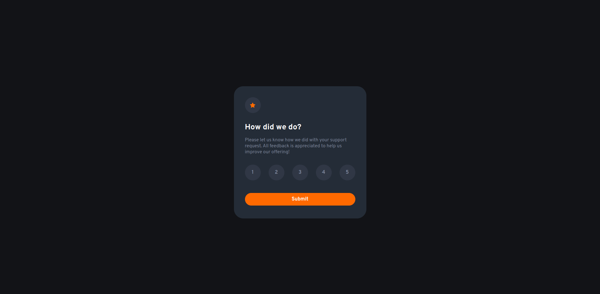
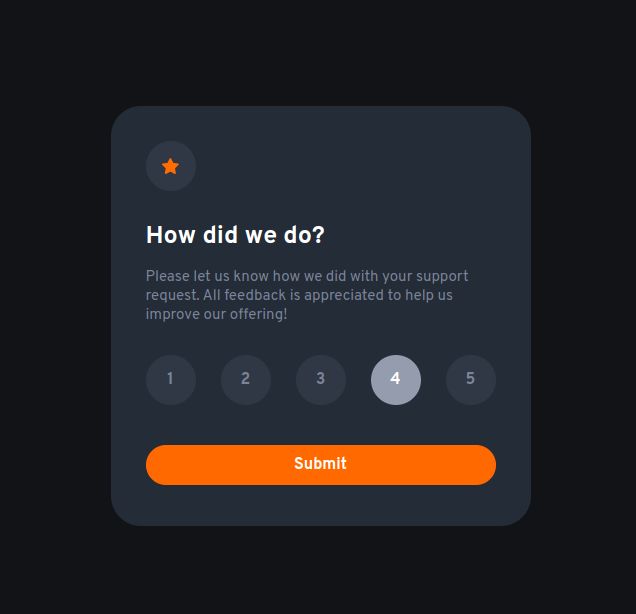
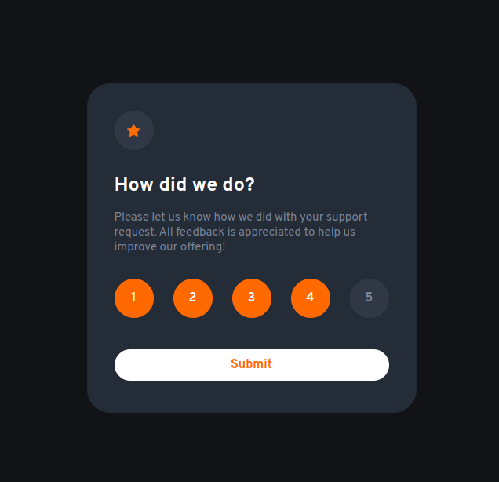
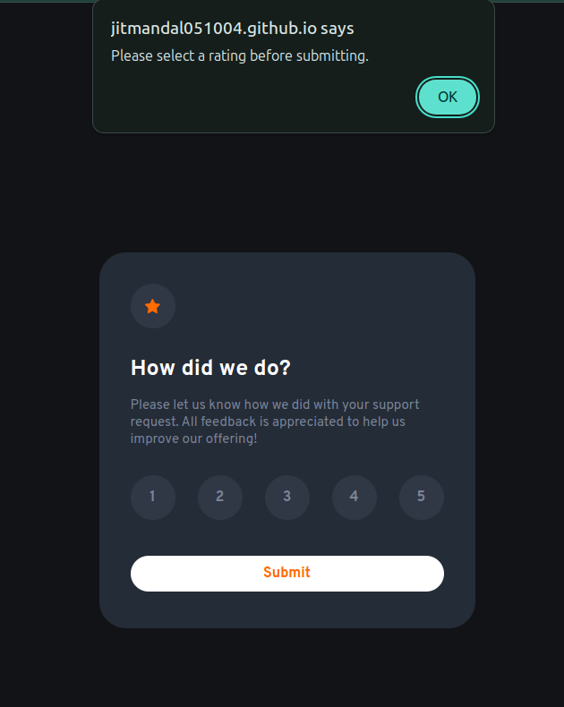
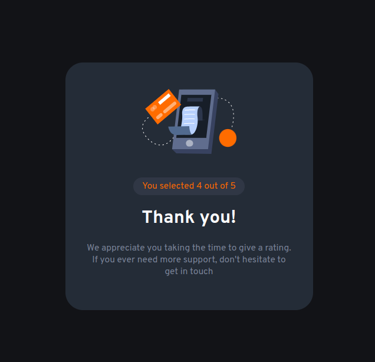

# Frontend Mentor - Interactive rating component solution

This is a solution to the [Interactive rating component challenge on Frontend Mentor](https://www.frontendmentor.io/challenges/interactive-rating-component-koxpeBUmI). Frontend Mentor challenges help you improve your coding skills by building realistic projects. 

## Table of contents

- [Overview](#overview)
  - [The challenge](#the-challenge)
  - [Screenshot](#screenshot)
  - [Links](#links)
- [My process](#my-process)
  - [Built with](#built-with)
  - [What I learned](#what-i-learned)
  - [Continued development](#continued-development)
  - [Useful resources](#useful-resources)
- [Author](#author)


## Overview

### The challenge

Users should be able to:

- View the optimal layout for the app depending on their device's screen size
- See hover states for all interactive elements on the page
- Select and submit a number rating
- See the "Thank you" card state after submitting a rating

### Screenshot

- Non-active State


- Hover and clicked State



- Alert State


-Thankyou State



### Links

- [Solution URL](https://www.frontendmentor.io/solutions/interactive-rating-component-HeAX26xXWA)
- [Live Site URL](https://github.com/Jitmandal051004/Interactive-rating/settings/pages)

## My process

### Built with

- Semantic HTML5 markup
- CSS custom properties
- Flexbox
- Javascript


### What I learned

I learnt how to manipulate DOM by Javascript and also change style when required. Addition to this I learnt about Transition and Animation.

```js
rate.forEach(Span => {
    Span.addEventListener("click", () =>{
        const clickedId = parseInt(Span.id);

        if(selectedId === clickedId){
            selectedId = 0;
        }else{
            selectedId = clickedId;
        }

        console.log(selectedId)

        rate.forEach(s => {
            const spanId = parseInt(s.id);
            if (spanId <= selectedId) {
                s.style.backgroundColor = 'hsl(25, 97%, 53%)';
                s.style.color = 'hsl(0, 0%, 100%)';
            } else {
                s.style.backgroundColor = '';
                s.style.color = '';
            }

        })
    })
})
```

### Continued development

I would work on the alert state. Instead of having pop-out, I want to have proper dialogue box which occurs if user submit it without the Rating.

### Useful resources

- [Javascript DOM Manipulation](https://www.youtube.com/watch?v=5fb2aPlgoys) - This helped me to learn about DOM manipulation.
- [Even Listener](https://www.youtube.com/watch?v=XF1_MlZ5l6M) - It is a good short video to recap the concept of Event listener

## Author

- Hashnode Blog - [Indrajit Mandal](https://jitm25.hashnode.dev/)
- Frontend Mentor - [@Jitmandal051004](https://www.frontendmentor.io/profile/Jitmandal051004)
- Twitter - [@mandal24_jit](https://twitter.com/mandal24_jit)


